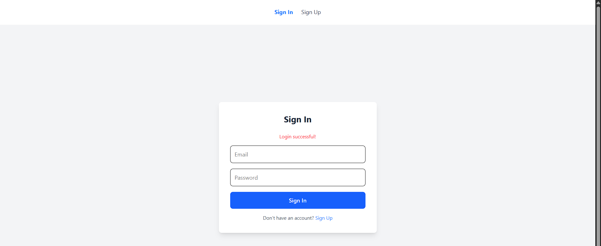

# PreTrade — React + Vite + Express (Auth, RBAC & Tasks CRUD)

**PreTrade** is a modern full-stack starter: a React + Vite frontend with Tailwind UI and an Express + MongoDB backend.  
Features include JWT authentication, role-based access control (RBAC), and a Task management (CRUD) API where tasks are owned by users.

---

## Table of contents

- [Demo / Screenshots](#demo--screenshots)  
- [Features](#features)  
- [Tech stack](#tech-stack)  
- [Project structure](#project-structure)  
- [Requirements](#requirements)  
- [Environment variables](#environment-variables)  
- [Installation & run (local)](#installation--run-local)  
  - [Backend](#backend)  
  - [Frontend](#frontend)  
- [API Reference (quick)](#api-reference-quick)  
  - [Auth](#auth)  
  - [Tasks (CRUD)](#tasks-crud)  
- [Frontend integration notes](#frontend-integration-notes)  
- [Security & production notes](#security--production-notes)  
- [Troubleshooting](#troubleshooting)  
- [Contributing](#contributing)  
- [License](#license)

---

## Demo / Screenshots

### Sign In

### Sign Up

### Task CRUD with Authorization & RBAC

---

## Folder structure

| Path | Type | Description |
|      |      |             |
| `/`  | directory | Project root (contains `frontend/`, `backend/`, README, etc.) |
| `backend/` | directory | Express backend source & config |
| `backend/index.js` | file | Main server entry (connects DB, registers routes, middleware) |
| `backend/.env` | file | Environment variables (`MONGO_URI`, `JWT_SECRET`, `PORT`) |
| `backend/models/` | directory | Mongoose models |
| `backend/models/user.js` | file | User schema (email, password, role) |
| `backend/models/task.js` | file | Task schema (title, description, completed, user) |
| `backend/controllers/` | directory | Route handlers / business logic |
| `backend/controllers/authController.js` | file | Register / Login (hashing, JWT creation) |
| `backend/controllers/task.js` | file | Tasks CRUD (create, read, update, delete) |
| `backend/middleware/` | directory | Express middleware |
| `backend/middleware/authMiddleware.js` | file | JWT verification + attach `req.user` + RBAC checks |
| `backend/routes/` | directory | Express route definitions |
| `backend/routes/auth.js` | file | `/api/auth` routes: register, login |
| `backend/routes/task.js` | file | `/api/tasks` routes: create, list, get, update, delete |
| `backend/package.json` | file | Backend dependencies & scripts |

## Features

- JWT-based authentication (login / register)
- Role-Based Access Control (RBAC): `user` and `admin`
- Tasks CRUD (each task has an owner → user)
- Protected backend routes (middleware verifies JWT & user)
- Frontend uses Context API to persist auth state and protect routes
- Tailwind CSS UI components for Sign In / Sign Up / Tasks
- CORS enabled for local development

---

## Tech stack

- Frontend: React + Vite, Tailwind CSS, React Router, Context API
- Backend: Node.js, Express, Mongoose (MongoDB)
- Auth: JSON Web Tokens (JWT), bcrypt for hashing
- Dev tooling: nodemon (backend), Vite (frontend)

---

## Project structure (high-level)

